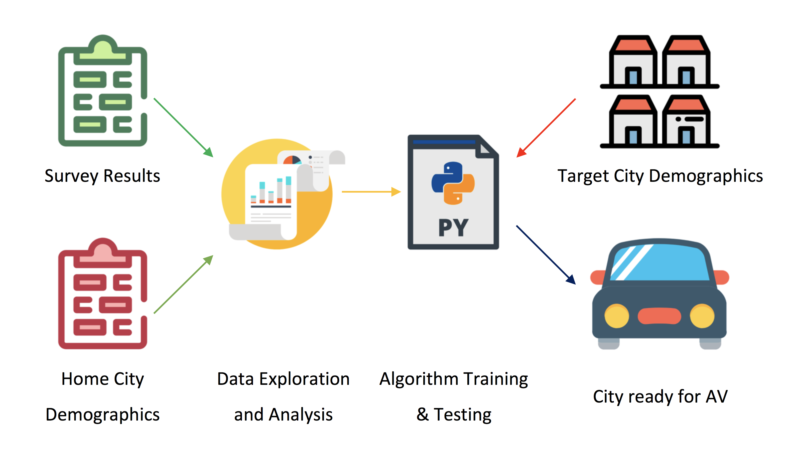

<b> Autonomous Vehicle Deployment </b>
 

Purpose of this project is to create a tool that can increase effectiveness and efficiency of AV deployment. One of the solutions is to conduct surveys and collect data from citizens of Pittsburgh and analyze demographics of participants. Create train and test datasets based on publically available demographics data of ZIP codes of participants combined with survey results. Further train an algorithm which can predict readiness of target city for AV deployment. Data flow illustrated on figure 1. 

 

Trained and fine-tuned algorithm can be used to create heat map of entire country. Decision maker will need either that map, or an application where he can dial in demographics data of a target zip code and see what are the predicted chances of success in deploying AV in that area. 
